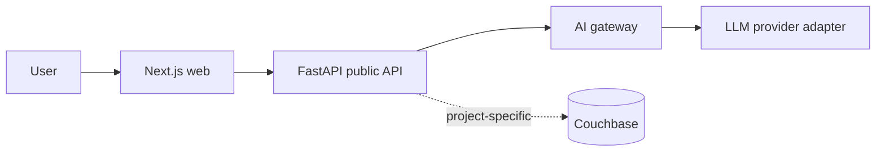

# Architected AI Starter — System Architecture

**Status:** Replace this starter architecture with the project-specific target architecture during initialization.

## 1. Product summary

See `docs/product/project-brief.md`.

## 2. Non-negotiable constraints

Record only constraints that are genuinely fixed for this project. Examples: mandated cloud, mandated database, compliance boundary, offline capability, latency target, or an immutable integration contract.

1. **Application-owned contracts.** External provider types do not become public/domain contracts.
2. **Offline walking skeleton.** Core development and CI do not require cloud credentials.
3. **Truthful capability reporting.** Disabled or unimplemented features are never presented as active.
4. **Unsafe production configurations fail startup.** They do not degrade silently.

## 3. Starter topology

### Why API and AI gateway are separate

Long-running model calls have different timeout, scaling, retry, and failure characteristics from ordinary API traffic. If a new project does not need this separation, merge them deliberately and record the decision rather than keeping an accidental service boundary.

## 4. Core contracts

- `packages/domain-models`: application-owned data/event contracts.
- `packages/llm-client`: provider-neutral model protocol.
- `packages/couchbase-client`: persistence configuration/adapter boundary.
- `packages/observability`: logging/correlation rules shared by services.

Add project-specific contracts here before multiple consumers depend on them.

## 5. Data architecture

Define bucket/scope/collection ownership, key strategy, idempotency rules, indexes, retention, and migration policy here. Do not let database structure emerge implicitly from repository methods.

## 6. AI architecture

Document:

- provider/model roles;
- prompt ownership/versioning;
- tool boundaries;
- authorization context injection;
- evaluation fixtures and acceptance thresholds;
- code-enforced gates;
- fallback/degraded behavior;
- what AI provenance is persisted.

## 7. Security model

See `docs/security/security-model.md`. Summarize the trust boundaries and enforcement points here once known.

## 8. Observability

Every service should provide structured logs, correlation/request ids, liveness, readiness, and metrics appropriate to its role. AI paths should additionally measure provider latency, tokens/cost where available, tool latency, failure class, and run outcome.

## 9. Environments

At minimum distinguish local development, CI/test, and a cloud development environment. Add staging/demo/production only when each has a concrete purpose and lifecycle.
